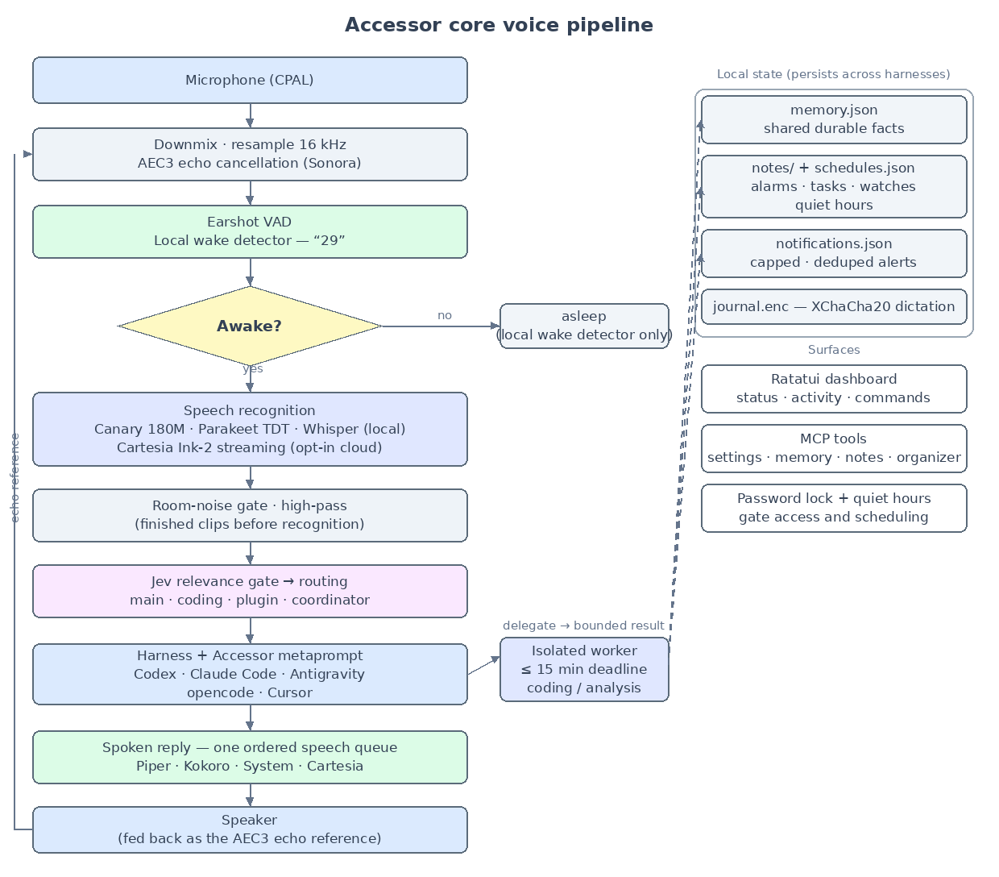
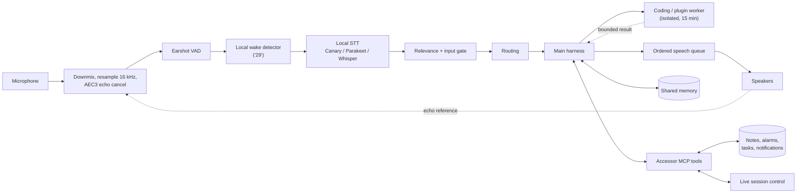
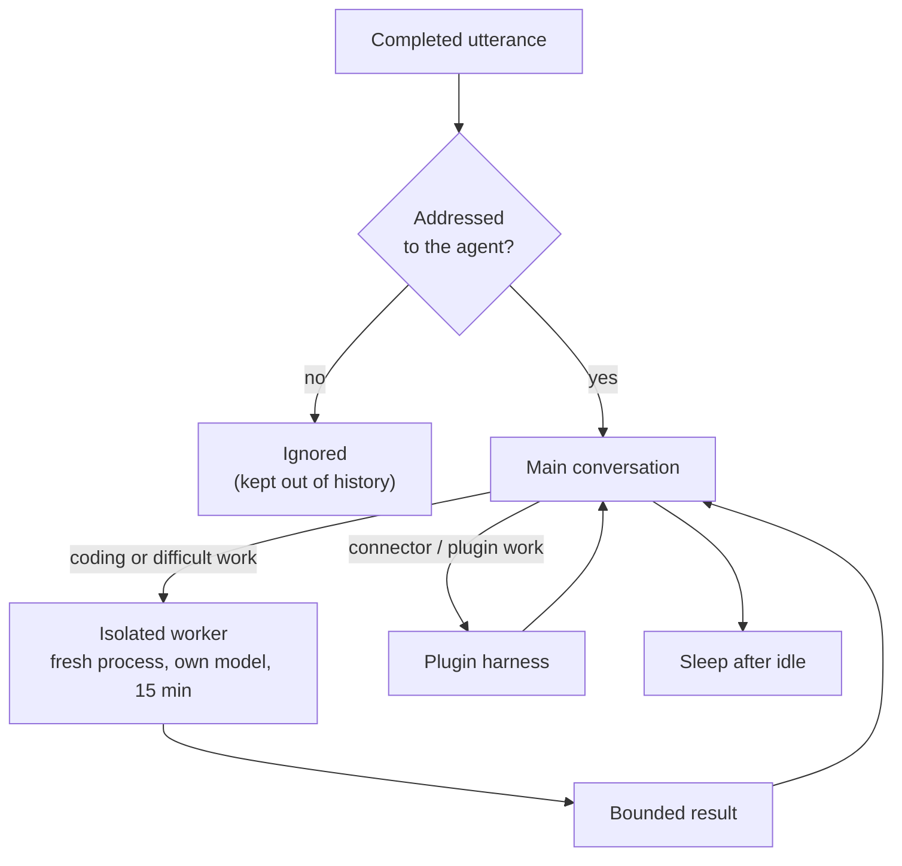
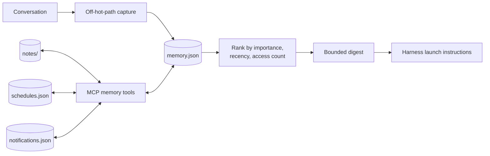
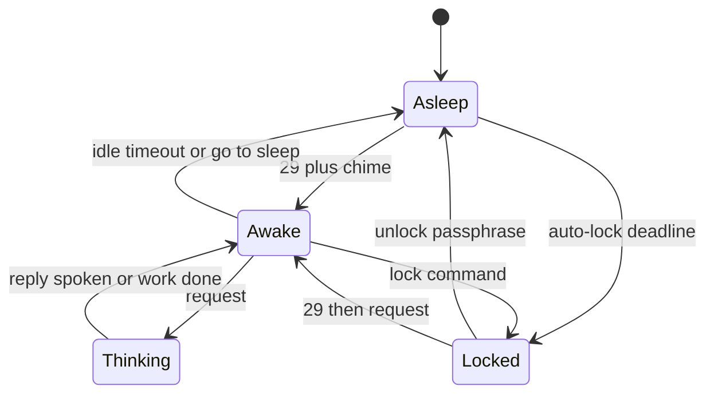
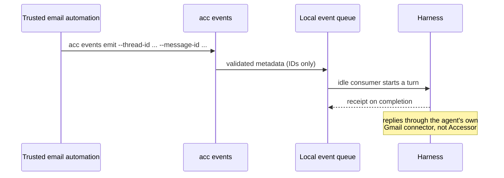
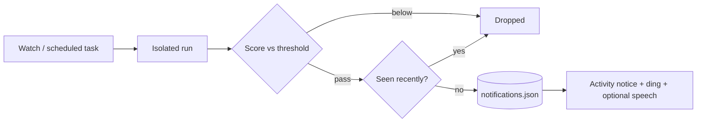

# Architecture

Accessor is a long-lived local process that sits between a microphone and one or
more command-line agent harnesses. It owns the latency-sensitive path (capture,
wake, speech recognition, playback) and the durable local state (settings, shared
memory, the organizer, notifications, the encrypted journal). Each harness keeps
its own tools, sandbox, and native conversation thread.

The diagrams below render on this site and on GitHub. The editable source of the
pipeline diagram is [`docs/diagrams/29.dot`](https://github.com/T-Lind/accessor/blob/main/docs/diagrams/29.dot);
regenerate the PNG with Graphviz `dot`.

## End-to-end voice pipeline

## Component map

The microphone path is local and bounded; the agent path is asynchronous. Nothing
on the capture path waits on a network call.

## Routing and delegation

Relevance and routing decide whether speech is addressed to the agent, then pick
the main, coding, or plugin role. With the coordinator policy (on by default) a
lightweight main agent owns the conversation and delegates from its metaprompt;
keyword/state routing is the optional legacy path.

## Memory and MCP

Shared memory is a local JSON store with file locking and atomic replacement.
A bounded, ranked digest is injected when a harness starts (not every turn), so
saving a fact does not restart a warm session or break provider prompt caching.
Accessor's MCP server exposes memory, notes, the organizer, session controls,
harness health, and subscription usage over stdio.

## Wake, sleep, and lock states

Sleep ends active listening but leaves the local wake detector on. The password
lock is separate and blocks both voice and typed access. Auto-lock is an absolute
deadline since the last successful unlock.

See [Local access lock](SECURITY.md) for the threat model and recovery steps.

## Incoming events

The only supported event source is the local `acc events emit` handoff. Accessor
opens no HTTP listener and stores no provider credentials.

## Watches and notifications

A watch is a recurring, gated survey. Each run is an isolated worker that may
emit only `notify` findings; each finding is scored and deduplicated before it
reaches you.

## Where the work runs

| Stage | Where | Hot path? |
| --- | --- | --- |
| Capture, resample, AEC3 | Rust audio thread | Yes |
| VAD and wake detection | Rust, bounded rolling windows | Yes |
| Local STT | Rust / ONNX on completed clips | Off the UI loop |
| Cloud STT (opt-in) | WebSocket upload while awake | Off the wake path |
| Routing and relevance | Rust, optional Jev classifier | Off capture |
| Harness processes | Child processes under a job object / process group | Async |
| Memory, organizer, triggers | File-locked local stores | Moved off the event loop |
| Synthesis and playback | Ordered queue with echo reference | Feeds AEC |

## Design rules

- **Keep the hot path clear.** Wake detection, STT, and playback are
  latency-sensitive. New work (network, disk, model loads, subprocesses) belongs
  off that path, and overload is reported visibly.
- **Local by default.** Cloud transcription and speech are opt-in, and credentials
  live in the OS credential store, never in `config.json`.
- **Bounded everything.** Queues, rolling windows, memory, notifications, and
  worker output are capped. Agent-authored data is never authority.
- **Fail closed.** Malformed password files, unreadable journal keys, and
  unsupported approval requests are refused rather than guessed.

